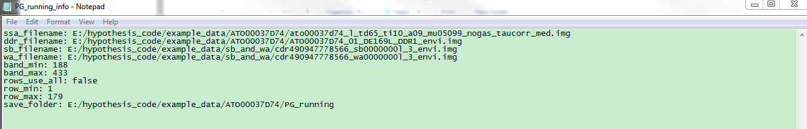
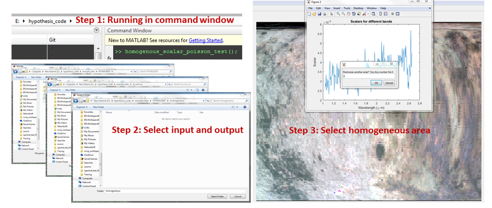

This is the MATLAB+Cpp version by 03/13/2019.
# 1. Simulations
This code is used to simulate how two different algorithms work for the CRISM-like scaled Poisson distributed data.

**Input**: Groundtruth projected hyperspectral image (default: ground_truth_c.bsq) and sensor data (default: ground_truth_mu.bsq), corresponding DDR (default: ground_truth_ddr.bsq), SB file (default: cdr490947778566_sb0000000l_3_envi.img) and WA file (default: cdr490947778566_wa0000000l_3_envi.img).

**Parameters**: Number of simulations (default: N=10), number of iterations (default: num_iter=250), scalar for Poisson (default: scalar=$10^4$).

**Output**: MLM results based on scaled Poisson distribution (Algorithm1) and Gaussian distribution (Algorithm2).

## Running Step
1. Download all files.
2. Open the file "simulation_main.m" in MATLAB and change the input filenames, input and output folders and parameters in the first 10 lines.
3. Run the file "simulation_main.m".
4. Outputs are saved to the output folder you just defined in step 2.

# 2. Model Selection between scaled Poisson and Gaussian
This code is used to select the statistical model based on data itself.

**Input**: SB file (default: cdr490947778566_sb0000000l_3_envi.img), WA file (default: cdr490947778566_wa0000000l_3_envi.img) and a folder containing: 
1. ssa and corresponding ddr;
2. An input parameter txt file named "PG_running_info". Example: ;
3. Create an empty folder named "PG_running" to save the output results.

**Parameters**: Number of iterations for algorithm1 and algorithm2 (default: num_iter_p=30 and num_iter_g=150).

**Output**: 
1. Multiple results from algorithm1 and algorithm2. 
2. An output txt file named "PG_running_info.txt". Example: ;
3. P-value figure for this model selection named "PG_running_info.txt".

## Running Step
1. Download all files.
2. Prepare the input folder named "example_folder".
2. Open the file "PG_model_selection.m" in MATLAB and change number of iterations if necessary.
3. Type and run PG_model_selection(example_folder). (replace the example_folder by any name you give to the input folder).
4. Outputs are saved to the output folder "PG_running" under "example_folder".

# 3. CRISM homogenous area Poisson distribution test
This code is used to visualize the scaled Poisson distribution approximation of a homogeneous area.

**Input**: SSA, WA files and output folder path

**Parameters**: Display forced color bands (default as [24, 174, 242]), output filenames and output animation frame rate (default as 2)

**Output**: 
1. Video file records all distribution approximations for all bands; 
2. Selected homogeneous area spatial display figure;
3. Retrieved scalars for all bands of the selected homogeneous area.

## Running Step
See the intruction steps (only for CRISM L-data now):

;